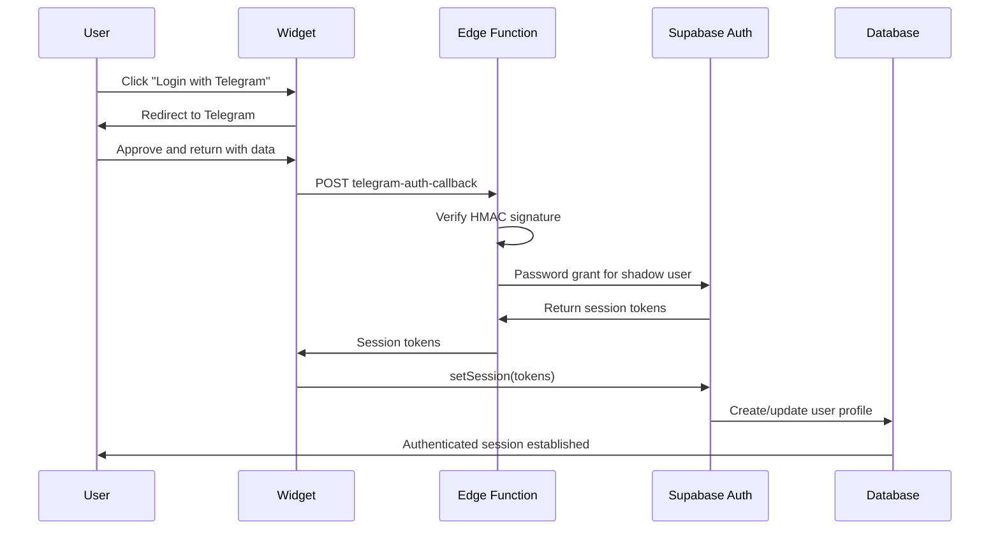

# IPS Poker Club Website 🎯

> **Modern React SPA** built with Vite + Tailwind CSS + Supabase  
> **Robust Authentication** with Email/Password + Telegram OAuth  
> **Production Ready** with comprehensive auth synchronization and mobile optimizations  
> **Hosted on** GitHub Pages at [www.ipokerstyle.com](https://www.ipokerstyle.com)

---

## 🎮 **What This Is**

**IPS (International Poker Style)** is a complete poker club management system with two interconnected applications:

1. **🌐 Website (this repo)** - Public-facing React SPA for tournament management, player registration, calendar, ratings, and admin tools
2. **⏱️ Timer App** - Python desktop application used during live events for tournament execution (separate codebase)

Both apps share a **single Supabase database** for seamless data synchronization.

---

## ✨ **Key Features**

### 🔐 **Advanced Authentication System**
- **Email/Password** authentication with automatic profile creation
- **Telegram OAuth** via secure Edge Function with HMAC verification
- **Auth State Synchronization** - prevents race conditions on multi-device usage
- **Mobile Network Resilience** - enhanced retry logic for high-latency connections
- **iOS Safari Stability** - comprehensive background context handling

### 🏆 **Tournament Management**
- **Visual Calendar** with tournament types (Стандартный, Специальный, Фриролл, Рейтинговый)
- **Beautiful Icons** - dynamic tournament markers with type-specific styling
- **Registration System** - guest and member participation tracking
- **Live Results** - integration with timer app for real-time updates
- **Admin Tools** - complete CRUD operations for tournament management

### 📱 **Mobile-First Experience**
- **Responsive Design** with glassmorphism UI
- **2x2 Mobile Navigation** - optimized grid layout with icons
- **Personal Dashboard** - integrated admin access from user account
- **Network Optimization** - enhanced handling for Russian mobile carriers

### 🔧 **Developer Experience**
- **Modern Stack**: React 18 + Vite + Tailwind CSS + Framer Motion
- **TypeScript Edge Functions** with Deno runtime
- **Comprehensive Logging** with emoji-coded debug messages
- **Database Migrations** with proper version control
- **CI/CD Pipeline** via GitHub Actions

### 🎨 **UI Tokens & Styling Rules**
- * Где лежат токены: `frontend/src/ui/tokens.css`.
- * Импорт: в `src/index.css` первой строкой:
  `@import './ui/tokens.css';`
- * **Запрет хардкода** цветов/теней/радиусов в JSX/CSS — только через CSS Custom Properties (tokens).
- * **Важно про Tailwind arbitrary values:**
  В классах используй **`var()`**:
  * ✅ `bg-[var(--glass-bg)]`
  * ✅ `border-[var(--glass-border)]`
  * ✅ `text-[var(--toast-success-fg)]`
  * ❌ `bg-[--glass-bg]` (без `var()` не сработает)
  

- * Основные токены, которые уже есть (короткий список):

  * Glass: `--glass-bg`, `--glass-border`, `--glass-blur`, `--glass-border-weak`
  * Backdrop: `--backdrop-heavy`, `--backdrop-blur`
  * Radii: `--r-s`, `--r-m`, `--r-l`, `--r-2xl`
  * Shadows: `--shadow-s/m/l`, `--panel-shadow`, `--panel-shadow-inset`
  * Toast: `--toast-*-bg/border/fg`
  

- * Примеры использования (одна строка на пример):

  * `className="bg-[var(--glass-bg)] backdrop-blur-[var(--glass-blur)] border border-[var(--glass-border)]"`
  * `className="text-[var(--toast-error-fg)] border-[var(--toast-error-border)]"`

---

## 🚀 **Quick Start**

### Prerequisites
- Node.js 20+
- npm or yarn
- Supabase project (create at [supabase.com](https://supabase.com))

### 1. Environment Setup

Create `frontend/.env.local`:

```env
# Supabase Configuration
VITE_SUPABASE_URL=https://your-project.supabase.co
VITE_SUPABASE_ANON_KEY=your_anon_key_here

# Telegram Bot Configuration
VITE_TELEGRAM_BOT_USERNAME=your_bot_username    # without @
VITE_TELEGRAM_BOT_ID=1234567890                 # numeric bot ID

# Development (optional)
VITE_PUBLIC_HOST=localhost:5173
```

### 2. Install & Run

```bash
cd frontend
npm ci
npm run dev
```

### 3. Open Browser

Navigate to `http://localhost:5173` and start developing!

---

## 🏗️ **Architecture Overview**

```
┌──────────────────┐    ┌──────────────────┐    ┌─────────────────┐
│   React SPA      │    │   Supabase       │    │   Timer App     │
│   (Frontend)     │◄──►│   (Backend)      │◄──►│   (Python)      │
│                  │    │                  │    │                 │
│ • Authentication │    │ • PostgreSQL     │    │ • Tournament    │
│ • Tournament UI  │    │ • Edge Functions │    │   Execution     │
│ • Admin Panel    │    │ • Real-time DB   │    │ • Results       │
│ • Player Profiles│    │ • Row Level      │    │   Tracking      │
└──────────────────┘    │   Security       │    └─────────────────┘
                        └──────────────────┘
```

## 🤖 **CODEX & Internal Agent Rules**

* Смотри `frontend/CODEX.md` — правила агента (one-time read batch, report-first → patch-set).
* DEV используется **как эталон паттернов** (токены/стили), **но** PROD-визуал/поведение не деградируем.
* **Где лежат подробные отчёты:** только в DEV —
  `ips-ui-lab/frontend/src/PROD_comparison/reports/` и `.../drafts/`.
  В PR кладём **краткое описание** (цель/изменения/проверка), а не длинный отчёт.

### Codex auto-review & пинги (как это срабатывает)
* Авто-ревью триггерится на `pull_request` события: **opened**, **ready_for_review**, **synchronize**, **reopened**.
* Экшен ставит лейбл `codex:review` и оставляет **новый комментарий-пинг** на свежий SHA.
* Для комментария используется `secrets.AUTO_PR_TOKEN` (PAT). Если недоступен — возможен fallback на `GITHUB_TOKEN`
  (комментарий будет от github-actions[bot]). 
* Не запрашиваем ревью у **автора PR** (GitHub вернёт 422).
* Для PR из **fork** шаг с PAT следует пропускать (guard), чтобы не ломать внешний вклад.


### Authentication Flow



---

## 📁 **Project Structure**

```
ips-website/
├── frontend/                          # React SPA
│   ├── src/
│   │   ├── components/
│   │   │   ├── features/
│   │   │   │   ├── Admin/              # Tournament management
│   │   │   │   ├── Auth/               # Login components
│   │   │   │   │   ├── AuthModal.jsx
│   │   │   │   │   ├── TelegramLoginWidget.jsx
│   │   │   │   │   └── TelegramLoginRedirect.jsx
│   │   │   │   ├── TournamentCalendar/  # Calendar & tournaments
│   │   │   │   │   ├── TournamentCalendar.jsx
│   │   │   │   │   ├── EventMarker.jsx
│   │   │   │   │   └── UpcomingTournamentsModal.jsx
│   │   │   │   └── ValueProps/         # Landing page sections
│   │   │   ├── layout/                 # Header, Footer, etc.
│   │   │   └── ui/                     # Reusable UI components
│   │   ├── contexts/
│   │   │   └── AuthContext.jsx         # Global auth state
│   │   ├── lib/
│   │   │   ├── supabaseClient.js       # Single Supabase instance
│   │   │   ├── authSynchronizer.js     # ⭐ NEW: Race condition prevention
│   │   │   ├── sessionUtils.js         # Session establishment utilities
│   │   │   ├── preAuthCleanup.js       # Pre-auth state cleanup
│   │   │   ├── validatedStorage.js     # Storage wrapper with validation
│   │   │   └── iosSafariUtils.js       # iOS Safari stability fixes
│   │   ├── pages/
│   │   │   ├── HomePage.jsx            # Landing page
│   │   │   ├── DashboardPage.jsx       # User dashboard
│   │   │   ├── AdminDashboardPage.jsx  # Admin interface
│   │   │   └── TelegramCallbackPage.jsx # OAuth callback handler
│   │   └── hooks/, styles/, utils/
│   ├── public/
│   └── index.html
└── supabase/
    ├── functions/
    │   ├── telegram-auth-callback/      # Telegram OAuth handler
    │   │   └── index.ts
    │   └── mock-tournament-ender/       # Development utility
    │       └── index.ts
    └── migrations/                      # Database schema changes
        └── *.sql
```

---

## 🛠️ **Available Scripts**

```bash
# Development
npm run dev         # Start development server (localhost:5173)
npm run build       # Build for production
npm run preview     # Preview production build

# Code Quality
npm run lint        # Run ESLint
npm run type-check  # TypeScript checking (if applicable)

# Database
# (Migrations are applied via Supabase CLI or Dashboard)
```

---

## 🔧 **Configuration**

### Environment Variables

#### Frontend (`.env.local`, `.env.production`)
```env
# Required
VITE_SUPABASE_URL=                    # Your Supabase project URL
VITE_SUPABASE_ANON_KEY=               # Public anon key
VITE_TELEGRAM_BOT_USERNAME=           # Bot username (without @)
VITE_TELEGRAM_BOT_ID=                 # Numeric bot ID

# Optional
VITE_PUBLIC_HOST=localhost:5173       # Development host
```

#### Edge Function (`telegram-auth-callback`)
Configure these in Supabase Dashboard → Functions → Environment Variables:

```env
SUPABASE_URL=                         # Same as frontend
SUPABASE_ANON_KEY=                    # Same as frontend  
SUPABASE_SERVICE_ROLE_KEY=            # Service role key (admin)
TELEGRAM_CLIENT_SECRET=               # Bot token from @BotFather
SHADOW_PASSWORD_SECRET=               # Salt for deterministic passwords
DEBUG_TELEGRAM_BYPASS=false           # Set to 'true' only in development
```

### CORS Configuration

Update `ALLOW_ORIGINS` in `supabase/functions/telegram-auth-callback/index.ts`:

```typescript
const ALLOW_ORIGINS = [
  'https://www.ipokerstyle.com',      # Production domain
  'https://ipokerstyle.com',          # Alternative domain
  'https://your-preview.vercel.app',  # Preview deployments
  'http://localhost:5173',            # Local development
];
```

### Supabase Authentication URLs

In Supabase Dashboard → Authentication → URL Configuration, add:

- `https://www.ipokerstyle.com`
- `https://www.ipokerstyle.com/auth/telegram/callback`
- `http://localhost:5173` (for development)
- Any other domains you use

---

## 🎯 **Key Innovations**

### 🔄 **Auth State Synchronization**

**Problem Solved**: Multi-device Telegram auth conflicts, logout/login race conditions, mobile network timeouts.

**Solution**: `authSynchronizer.js` provides:
- **Device Fingerprinting**: Distinguishes auth sources
- **Concurrent Auth Prevention**: Detects and cancels conflicting attempts  
- **Session Deduplication**: One active auth per user/device
- **Graceful Fallbacks**: User-friendly error messages for conflicts

```javascript
// Example usage
import { isAuthInProgress, synchronizedTelegramAuth } from '@/lib/authSynchronizer';

if (isAuthInProgress(userId)) {
  showMessage('Authentication in progress...');
  return;
}

const result = await synchronizedTelegramAuth(telegramData, authFunction);
```

### 📱 **Mobile Network Resilience**

Enhanced retry logic with exponential backoff for high-latency networks:

```javascript
// Automatic retry for network issues
const result = await completeTelegramAuthFlow(telegramData, {
  edgeFunction: {
    maxAttempts: 3,
    initialDelay: 1000,      # Start with 1s
    timeoutPerAttempt: 10000 # 10s timeout per attempt
  },
  session: {
    maxWaitTime: 15000,      # Total session establishment timeout
    verificationDelay: 200   # Polling interval for session verification
  }
});
```

### 🎨 **Visual Tournament System**

Dynamic tournament icons and styling based on configurable types:

```javascript
const tournamentTypes = {
  'Стандартный': { icon: '🎯', color: 'teal' },
  'Специальный': { icon: '⭐', color: 'gold' },  
  'Фриролл': { icon: '⚡', color: 'red' },
  'Рейтинговый': { icon: '🏆', color: 'gold' }
};
```

---

## 🧪 **Testing Strategy**

### Smoke Tests (Required after each deployment)

1. **✅ Basic Functionality**
   - [ ] Homepage loads and navigation works
   - [ ] Tournament calendar displays
   - [ ] Modal dialogs open correctly

2. **🔐 Authentication Tests**
   - [ ] Email login/logout works
   - [ ] Telegram login/logout works
   - [ ] Session persists across page refresh
   - [ ] Multi-tab behavior is stable

3. **📱 Mobile-Specific Tests**
   - [ ] Mobile navigation (2x2 grid) functions
   - [ ] Touch interactions work smoothly
   - [ ] Portrait/landscape orientation changes

4. **🍎 iOS Safari Critical Tests**
   - [ ] **Background/Foreground Cycle**: Minimize Safari for 2 minutes → return → logout → login again
   - [ ] **Network Switch**: WiFi → Mobile data during auth process
   - [ ] **Multiple Tabs**: Open site in 2+ Safari tabs, login in one

### Load Testing

For high-traffic scenarios:

```bash
# Test concurrent auth attempts (development only)
# Multiple browser tabs + rapid login attempts
```

---

## 🐛 **Troubleshooting Guide**

### Common Issues & Solutions

#### 🔄 "Завершаем вход..." (Login Stuck)
**Symptoms**: Login spinner never completes  
**Causes**: Network timeout, session establishment failure  
**Solutions**:
1. Wait 20-30 seconds (mobile networks can be slow)
2. Check browser console for specific error messages
3. Try logout → login again
4. Clear browser cache if persistent

#### 🚫 "Authentication already in progress"
**Symptoms**: Cannot start new login  
**Cause**: Previous auth attempt still running  
**Solution**: Wait 60 seconds for automatic cleanup, or restart browser

#### 🔒 "Ошибка безопасности" (Security Error)
**Symptoms**: CSRF/state validation failure  
**Causes**: iOS Safari background context issues  
**Solutions**:
1. Clear Safari cache for the site
2. Use "Private Browsing" mode temporarily
3. Logout → wait 30 seconds → login again

#### 🌐 Network Timeout Errors
**Symptoms**: "Failed to send request to Edge Function"  
**Cause**: High latency mobile networks (especially Russian carriers)  
**Solution**: The system automatically retries - wait for completion

#### 💾 iOS Storage Issues
**Symptoms**: Login works once, then fails repeatedly  
**Solution**: 
1. Safari Settings → Privacy & Security → Manage Website Data → [yoursite] → Remove
2. Telegram Settings → Privacy & Security → Connected Websites → [yoursite] → Disconnect
3. Restart browser and try again

#### 🕳 Typical Tokenization Pitfalls

* Симптом: стеклянные панели «почернели» → проверь, что классы используют `var()` (см. выше).
* Симптом: изменился размыв — сравни `--glass-blur`/`--backdrop-blur` (24px/12px), проверь `@import './ui/tokens.css'`.
* Симптом: Toast цвета дефолтные → классы `bg-[var(--toast-*-bg)]`, `border-[var(--toast-*-border)]`, `text-[var(--toast-*-fg)]`.

---

## 🚀 **Deployment**

### GitHub Pages (Current Setup)

The project auto-deploys to GitHub Pages via GitHub Actions:

1. **Trigger**: Push to `main` branch
2. **Process**: 
   - Install dependencies
   - Create production `.env` from GitHub Secrets
   - Build project (`npm run build`)
   - Deploy to Pages with SPA fallback
3. **“Main is protected”**: деплой идёт **только** после **Squash merge** в `main`.
4. **Короткая памятка Rollback**: `git revert <SHA>` через PR (не пушем). 

### Environment Secrets (GitHub Repository Settings)

Configure these secrets for production deployment:

```
VITE_SUPABASE_URL=https://your-project.supabase.co
VITE_SUPABASE_ANON_KEY=your_anon_key
VITE_TELEGRAM_BOT_USERNAME=your_bot_username
VITE_TELEGRAM_BOT_ID=your_bot_id
```

### Custom Domain Setup

1. Add CNAME record: `www.ipokerstyle.com` → `username.github.io`
2. Configure in GitHub Pages settings
3. Enable HTTPS (automatic with GitHub Pages)

### Rollback Strategy

```bash
# Quick rollback to previous working version
git checkout main
git revert HEAD          # Revert last commit
git push origin main     # Triggers new deployment
```

---

## 🤝 **Contributing & PR Workflow**

### Development Workflow

1. **Create Feature Branch**
   ```bash
   git checkout -b feature/your-feature-name
   ```

2. **Follow Coding Standards**
   - Use `@` import alias (configured in `vite.config.js`)
   - Single Supabase client from `@/lib/supabaseClient`
   - Minimal useEffect dependencies
   - Comprehensive error handling

3. **Test Thoroughly**
   - Run smoke tests (see Testing section)
   - Test on multiple devices/browsers
   - Special attention to iOS Safari

4. **Submit Pull Request**
   - Small, focused changes
   - Clear description of changes
   - Include any necessary env var updates

5. **Branch protection:** прямые пуши в `main` запрещены → все изменения через PR.

6. **Именование веток:**
  `feat/...`, `fix/...`, `refactor/...`, `chore/...`, `docs/...`
  Примеры: `fix/tokens-var-wrappers`, `refactor/tokens-phase1`.

7. **Типы коммитов:** `feat:`, `fix:`, `refactor:`, `chore:`, `docs:`.
  Пример: `fix(tokens): wrap CSS vars in var() for Toast/GlassPanel`.

8. **Draft PR → Review → Squash merge:**

  1. Открывай **Draft PR** для серии мелких коммитов.
  2. Дожидайся авто-комментариев Codex (lint-ревью).
  3. Исправь, **resolve conversation** в PR (кнопка под комментарием).
  4. Конвертируй в **Ready for review** и **Squash & merge**.
  5. Ветки удаляются автоматически (или руками).

* **Требование к PR-описанию:** включай: цель, область затронутых файлов, риски, как проверить (используй отчёты из `reports/` как текст).
* **Локальный `main` не трогаем:** не коммить. Если разошёлся с `origin/main`:
  `git fetch && git reset --hard origin/main`.


### PR Checklist
- [ ] Changes are **scoped and reversible** (no config/deps changes)
- [ ] Visual **parity with PROD** (no UX/layout drift)
- [ ] All CSS uses **tokens**; no hard-coded rgba/hex in JSX
- [ ] Tailwind arbitrary values wrapped in **var()**
- [ ] Modal scroll is stable (`overflow-y:auto; min-height:0`)
- [ ] Added/updated report in `DEV/.../PROD_comparison/reports/` (optional link)
- [ ] All Codex PR comments resolved

### Code Style Guidelines

```javascript
// ✅ Good: Use @ alias imports
import { supabase } from '@/lib/supabaseClient';
import { Button } from '@/components/ui/Button';

// ❌ Bad: Relative imports
import { supabase } from '../lib/supabaseClient';

// ✅ Good: Synchronized auth operations
import { synchronizedTelegramAuth } from '@/lib/authSynchronizer';
const result = await synchronizedTelegramAuth(data, authFn);

// ❌ Bad: Direct auth calls without synchronization
const result = await completeTelegramAuthFlow(data);
```

---

## 📊 **Performance Monitoring**

### Key Metrics to Watch

1. **Authentication Success Rate**
   - Target: >95% success rate
   - Critical: <90% requires immediate investigation

2. **Page Load Times**
   - Target: <3s on 3G networks
   - Critical: >5s needs optimization

3. **Mobile vs Desktop Usage**
   - Current: ~60% mobile traffic
   - Optimize mobile-first

### Debug Logging

The application includes comprehensive logging with emoji-coded messages:

- 🔍 **Investigation**: Context inspection, data validation
- 🔄 **Process**: Ongoing operations, retries  
- ✅ **Success**: Completed operations
- ❌ **Error**: Failures requiring attention
- 🍎 **iOS**: iOS Safari specific operations
- 🇷🇺 **Mobile**: Mobile network specific handling

---

## 🔮 **Future Roadmap**

### Planned Features

- [ ] **Real-time Notifications**: Live tournament updates via Supabase Realtime
- [ ] **Advanced Analytics**: Player performance tracking and insights
- [ ] **Mobile App**: React Native version for iOS/Android
- [ ] **Multi-language Support**: English interface option
- [ ] **Tournament Streaming**: Integration with streaming platforms

### Technical Improvements

- [ ] **Performance**: Code splitting and lazy loading
- [ ] **TypeScript**: Gradual migration to TypeScript
- [ ] **Testing**: Unit and integration test coverage
- [ ] **Monitoring**: Real-time error tracking and analytics


### Known TODO (отдельный PR)
- [ ] Привести порядок импортов CSS к строгому:  
      `ui/tokens.css → @tailwind base/components → styles/*.css → @tailwind utilities`

### Changelog (кратко)
- **2025-11-02:** ModalBase — art-deco seam через `::after` на шве (одна линия; border делаем `transparent` при включённом деко).


---

## 📞 **Support & Contact**

### Getting Help

1. **Check Documentation**: This README and `CLAUDE.md`
2. **Search Issues**: Look for similar problems in GitHub Issues
3. **Create Issue**: If problem persists, create detailed issue report
4. **Contact**: Reach out to development team

### Issue Reporting Template

```markdown
**Environment**
- Browser: [Chrome 119, Safari 17, etc.]
- Device: [iPhone 15, Android, Desktop]
- Network: [WiFi, Mobile, specific carrier]

**Steps to Reproduce**
1. Step one
2. Step two
3. Expected vs actual result

**Console Errors**
[Include any browser console errors]

**Additional Context**
[Screenshots, network logs, etc.]
```

---

## 📄 **License & Credits**

### Technology Stack Credits

- **React** - Meta (Facebook)
- **Vite** - Evan You and team
- **Tailwind CSS** - Adam Wathan and team  
- **Supabase** - Supabase team
- **Framer Motion** - Framer team

### Development Team

Built with ❤️ by the IPS development team.

---

**🎯 Ready to contribute? Star the repo and dive in!**

---

*Last updated: November 2025*
